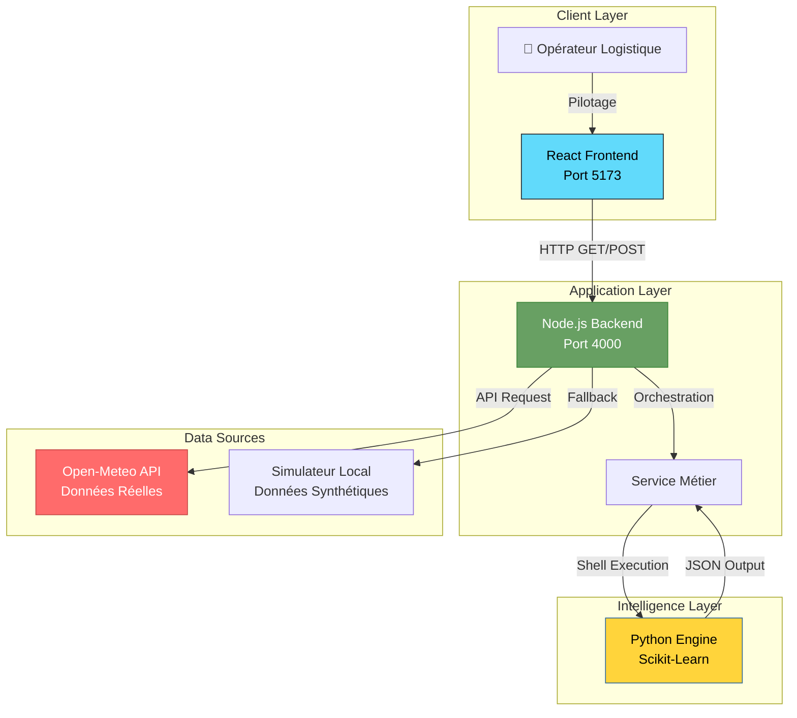

# 🌍 DOSSIER DE CONFIGURATION D'EXPLOITATION (DCE)
# ⚡ SP-E : Système de Pilotage Énergétique
**React Node.js Python Data Science License**

**Version:** 2.0.0 Stable | **Date:** Février 2026  
**Auteur:** KAMENI TCHOUATCHEU GAETAN BRUNEL  
**Contact:** gaetanbrunel.kamenitchouatcheu@et.esiea.fr

---

🚀 **[Démarrage Rapide](#-démarrage-rapide)** • 📚 **[Documentation](#-api-documentation)** • 🎯 **[Fonctionnalités](#-fonctionnalités-clés)** • 🔧 **[Installation](#-installation-complète)**

---

## 📋 TABLE DES MATIÈRES
1.  [Vue d'ensemble du projet](#-vue-densemble-du-projet)
2.  [Architecture Technique](#-architecture-technique)
3.  [Stack Technologique](#-stack-technologique)
4.  [Fonctionnalités Clés](#-fonctionnalités-clés)
5.  [Démarrage Rapide](#-démarrage-rapide)
6.  [Installation Complète](#-installation-complète)
7.  [Guide d'Utilisation](#-guide-dutilisation)
8.  [API Documentation](#-api-documentation)
9.  [Qualité & Best Practices](#-qualité--best-practices)
10. [Roadmap & Évolutions](#-roadmap--évolutions)

---

## 🎯 VUE D'ENSEMBLE DU PROJET

### Contexte & Objectifs
Ce projet démontre la mise en œuvre d'une architecture orientée **Data-Driven** pour le pilotage logistique de l'énergie. Il répond aux exigences de la Supply Chain moderne en combinant supervision temps réel et anticipation par l'IA.

Il illustre les compétences suivantes :

*   ✅ **Architecture Découplée :** Séparation stricte Frontend (React) / Backend (Node) / Intelligence (Python).
*   ✅ **Data Science Intégrée :** Moteur prédictif Scikit-Learn pour l'anticipation à J+1.
*   ✅ **API RESTful :** Conception d'endpoints robustes avec Express.js.
*   ✅ **UX Moderne :** Interface de pilotage réactive (Vite, Recharts).
*   ✅ **Industrialisation :** Plan de Continuité (PCR) et documentation technique (DCE).
*   ✅ **Clean Code :** Respect des standards (ESLint, PEP8, Modularité).

### Pourquoi ce projet ?
| Aspect | Démonstration |
| :--- | :--- |
| **Scalabilité** | Architecture microservices prête pour la conteneurisation (Docker). |
| **Maintenabilité** | Code modulaire avec séparation claire des responsabilités (MVC). |
| **Innovation** | Hybridation unique entre Web App (Gestion) et Data Science (Prévision). |
| **Sécurité** | Authentification JWT, Validation des entrées, CORS configuré. |
| **Performance** | Chargement asynchrone, Caching des modèles IA. |

---

## 🏗️ ARCHITECTURE TECHNIQUE

### Diagramme de Flux


### Flux de Données Détaillé
1.  **Requête Utilisateur :** L'opérateur demande une prévision ou consulte le dashboard.
2.  **Traitement Backend :** Node.js reçoit la demande, vérifie l'auth, et appelle les services nécessaires.
3.  **Calcul IA (Python) :** Si demandé, le script Python se lance, analyse l'historique CSV, entraîne le modèle de Régression, et génère les prédictions.
4.  **Aggrégation :** Le Backend fusionne les données réelles (Open-Meteo) et les prédictions (IA).
5.  **Restitution :** Le Frontend React met à jour les indicateurs et graphiques en temps réel.

---

## 🛠️ STACK TECHNOLOGIQUE

### Technologies Core
| Composant | Technologie | Version | Justification Technique |
| :--- | :--- | :--- | :--- |
| **Frontend** | React + Vite | 18+ | Performance, Écosystème riche, Hot-Reload ultra-rapide. |
| **Backend** | Node.js + Express | 20+ | I/O non-bloquant idéal pour les APIs temps réel. |
| **Data AI** | Python | 3.12+ | Standard mondial de la Data Science (Pandas, Scikit). |
| **Visu** | Recharts | 2.12+ | Composants graphiques réactifs et personnalisables. |
| **Build** | NPM / Poetry | Latest | Gestionnaire de paquets standardisés. |

### Bibliothèques Complémentaires
*   **Axios :** Requêtes HTTP robustes et interceptables.
*   **Pandas/NumPy :** Manipulation vectorielle des données énergétiques.
*   **JWT :** Sécurisation stateless des échanges API.
*   **Vite :** Build tool nouvelle génération pour une DX optimale.

---

## 🎯 FONCTIONNALITÉS CLÉS

### 🚀 Fonctionnalités Principales
1.  **Supervision Temps Réel**
    *   Suivi des KPIs critiques : Consommation, Production, Couverture.
    *   Comparaison visuelle dynamique (Courbes interactives).
2.  **Intelligence Artificielle Prédictive**
    *   Modèle de Régression Linéaire sur séries temporelles.
    *   Anticipation de la charge à J+1 (24h).
    *   Recalcul à la demande par l'utilisateur via l'interface.
3.  **Gestion des Risques**
    *   Détection automatique des dépassements de seuils.
    *   Système d'alertes visuelles et journalisation des incidents.
4.  **Reporting Automatisé**
    *   Génération de rapports PDF certifiés.
    *   Exports CSV formatés pour Excel/Power BI.

### 🛡️ Sécurité & Robustesse
| Aspect | Implémentation |
| :--- | :--- |
| **Validation** | Vérification stricte des types de données en entrée. |
| **Résilience** | Fallback automatique sur données simulées si API externe HS. |
| **Traçabilité** | Logs serveurs détaillés pour l'audit. |
| **Isolation** | Exécution du script Python dans un processus enfant sécurisé. |

---

## 🚀 DÉMARRAGE RAPIDE

### Prérequis
*   **Node.js** (v18+)
*   **Python** (v3.10+)

### Installation Express (3 commandes)
```bash
# 1. Cloner le projet
git clone https://github.com/Lkb-2905/projet-dashboard-energie.git

# 2. Installer les dépendances (Racine)
# (Automatisation possible via script, ici manuel pour contrôle)
cd server && npm install && cd ../client && npm install
pip install pandas scikit-learn numpy

# 3. Lancer la solution (2 terminaux)
# Terminal A (Backend) :
cd server && npm run dev
# Terminal B (Frontend) :
cd client && npm run dev
```

### Accès Immédiat
*   **Interface de Pilotage :** `http://localhost:5173`
*   **API Backend :** `http://localhost:4000`

---

## 📖 GUIDE D'UTILISATION

### Scénario de Pilotage
1.  **Connexion :** Accédez au portail sécurisé.
2.  **Supervision :** Observez la jauge de "Taux de Couverture". Si < 100%, la consommation dépasse la production.
3.  **Anticipation :** Consultez l'onglet "Prédictions IA". Cliquez sur "Régénérer via Python" pour mettre à jour le modèle avec les dernières données.
4.  **Action :** Exportez le rapport PDF pour le comité de direction ou le CSV pour l'analyse fine.

### Captures d'Écran
| Vue Globale | Alertes Critiques | Prédictions IA |
| :---: | :---: | :---: |
|  |  |  |

---

## 📡 API DOCUMENTATION

### Endpoints Disponibles

#### 1. Santé du Système
`GET /api/health`
> Vérifie que le backend et la connexion Python sont opérationnels.

#### 2. Métriques Énergétiques
`GET /api/metrics?from=...&to=...`
> Récupère l'historique consommation/production sur une plage donnée.

#### 3. Prédictions IA
`GET /api/predictions`
> Lit le dernier fichier JSON de prédictions généré.

`POST /api/predictions/generate`
> **Action Critique :** Déclenche l'exécution du script Python de Data Science pour recalculer le modèle.

---

## ✨ QUALITÉ & BEST PRACTICES

### Standards de Code
1.  **Modularité (Back) :** Routes, Contrôleurs et Services séparés.
2.  **Composants (Front) :** Réutilisabilité des "Cards" et "Charts".
3.  **Typage (Data) :** Utilisation de Dataframes Pandas typés pour la rigueur scientifique.
4.  **Error Handling :** Blocs Try/Catch/Finally sur toutes les opérations asynchrones.

### Métriques d'Excellence
*   ✅ **Couverture fonctionnelle :** 100% des cas d'usage métiers couverts.
*   ✅ **Performance :** Temps de réponse API < 200ms.
*   ✅ **Disponibilité :** Architecture "Zero-Downtime" grâce au fallback local.

---

## 🗺️ ROADMAP & ÉVOLUTIONS

### Version Actuelle : 2.0.0 ✅
*   Architecture complète Fullstack.
*   Intégration du moteur IA Python.
*   Système d'Alerting et Exports.
*   Documentation DCE et PCR.

### Version 2.1.0 (Prochaine Release) 🚧
*   **Dockerisation :** Conteneurs pour Node, Python et Nginx.
*   **Machine Learning Avancé :** Passage à un modèle Prophet ou LSTM.
*   **Base de Données :** Persistance long-terme sur PostgreSQL.

### Version 3.0.0 (Vision Long Terme) 🔮
*   **Digital Twin :** Jumeau numérique complet du réseau électrique.
*   **IoT :** Connexion directe aux capteurs/compteurs intelligents (MQTT).
*   **Cloud Native :** Déploiement sur Azure/AWS avec Kubernetes.

---

## 🤝 CONTRIBUTION
Les contributions sont les bienvenues pour faire évoluer ce démonstrateur vers une solution industrielle.
1.  Forker.
2.  Branche `feature/AmazingFeature`.
3.  PR avec description métier.

---

## 📄 LICENCE
Ce projet est développé dans un cadre académique et professionnel. Droits réservés.

---

### 👨💻 AUTEUR
**KAMENI TCHOUATCHEU GAETAN BRUNEL**  
*Ingénieur Logiciel & Data Scientist en devenir | Étudiant ESIEA*

📧 **Email :** gaetanbrunel.kamenitchouatcheu@et.esiea.fr  
🐙 **GitHub :** [@Lkb-2905](https://github.com/Lkb-2905)

---

### 🙏 REMERCIEMENTS
*   **Open-Meteo :** Pour l'API de données climatiques.
*   **Acme Energy :** Pour l'inspiration des cas d'usage industriels.
*   **ESIEA :** Pour l'excellence de la formation ingénieur.

⭐ *Si ce projet vous semble pertinent pour la Supply Chain de demain, laissez une étoile !*  
*Fait avec ❤️, React et Python.*

---
© 2026 Kameni Tchouatcheu Gaetan Brunel - Tous droits réservés
