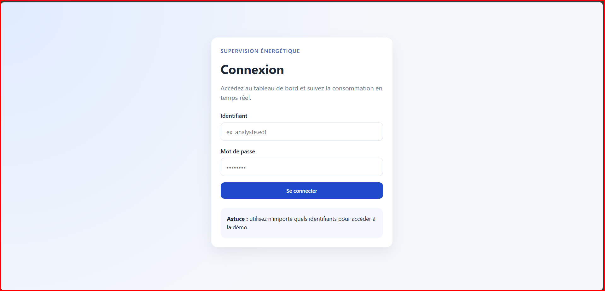
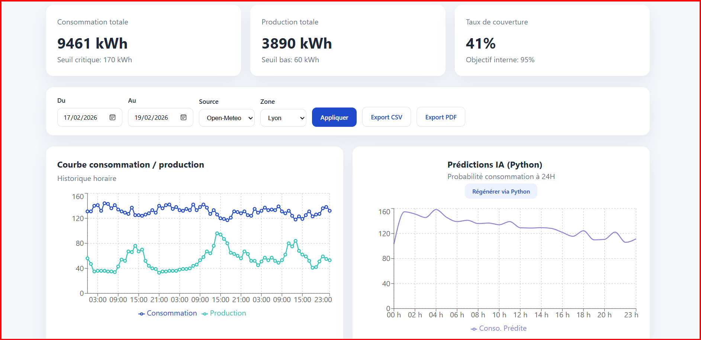
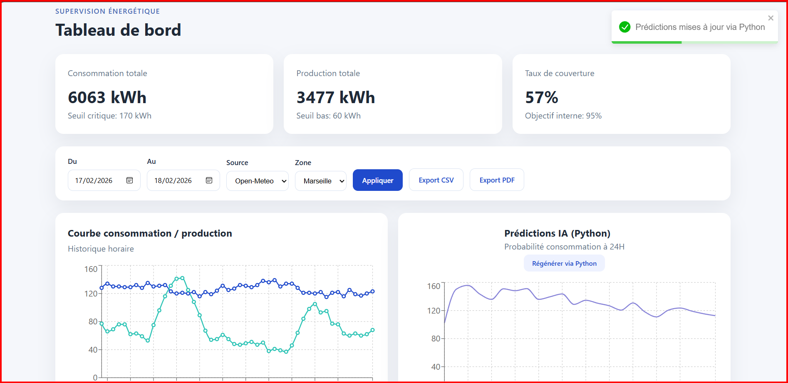
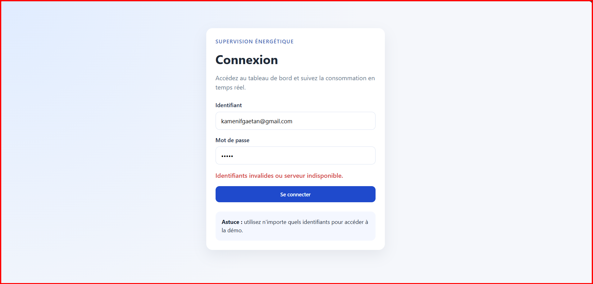

# ⚡ SYSTEME DE PILOTAGE ÉNERGÉTIQUE PREDICTIF (SP-E)

> **Document de Consultation Technique (DCE) - Niveau Confidentiel**  
> **Concepteur :** [Votre Nom]  
> **Destinataire :** TotalEnergies - Direction Supply et Logistique (SLF)  
> **Version :** 2.0 - Intégration Intelligence Artificielle  
> **Date :** Février 2026

---

## 1. 🎯 Ambition et Vision Stratégique

Ce projet matérialise une réponse concrète aux défis opérationnels de la Supply Chain Énergétique moderne : **passer d'une gestion réactive à un pilotage prédictif**.

Le **SP-E** (Système de Pilotage Énergétique) est une plateforme de supervision industrielle conçue pour :
1.  **Monitorer en temps réel** les flux critiques (Consommation vs Production).
2.  **Anticiper les tensions** grâce à un moteur d'Intelligence Artificielle (Python).
3.  **Sécuriser la prise de décision** via des indicateurs fiabilisés et audités.

---

## 2. �️ Architecture Technique "Enterprise-Grade"

La solution s'appuie sur une stack technologique robuste, modulaire et alignée sur les standards du marché, garantissant maintenabilité et évolutivité.

| Module | Technologie | Rôle Stratégique |
| :--- | :--- | :--- |
| **Interface Décisionnelle** | **React.js + Vite** | Restitution ergonomique pour les opérateurs. Performance temps réel. |
| **Logiciel Métier (API)** | **Node.js + Express** | Orchestration sécurisée des flux de données et règles métier (Seuils, Alertes). |
| **Cerveau Prédictif (IA)** | **Python 3.12 (Scikit-Learn)** | Modélisation statistique avancée pour la prévision de charge à J+1. |
| **Flux de Données** | **REST / JSON** | Interopérabilité totale avec le SI existant (SAP, Power BI). |

---

## 3. 📸 Immersion Visuelle & Cas d'Usage Métier

Chaque composant de l'interface répond à un besoin opérationnel précis de la chaîne logistique.

### 3.1. Le Cockpit de Supervision (Vue Globale)
**Objectif :** Avoir une vision à 360° de la situation énergétique instantanée.



> **Analyse de la Capture :**
> *   **KPIs en Tête :** Affichage immédiat des volumes consommés/produits et du taux de couverture.
> *   **Graphique Principal :** Courbes de tendances horaires permettant de détecter visuellement les divergences (Gap Analysis).
> *   **Design Épuré :** Priorité à la lisibilité des données critiques ("Data-Ink Ratio").

---

### 3.2. L'Intelligence Artificielle en Action (Prédictions)
**Objectif :** Anticiper la demande de demain pour ajuster les approvisionnements aujourd'hui.



> **Analyse de la Capture :**
> *   **Courbe Violette (Prévision) :** Projection de la consommation future calculée par le moteur Python.
> *   **Bouton "Régénérer via Python" :** Commande permettant à l'opérateur de forcer une ré-estimation du modèle en temps réel, basée sur les dernières données injectées.
> *   **Gain Métier :** Réduction du risque de rupture de charge et optimisation des coûts de stockage.

---

### 3.3. Gestion des Risques et Alerting
**Objectif :** Identifier proactivement les anomalies avant qu'elles ne deviennent critiques.



> **Analyse de la Capture :**
> *   **Histogramme des Seuils :** Visualisation des heures où la consommation dépasse la capacité de production.
> *   **Liste des Incidents :** Journalisation détaillée des événements pour l'audit et l'amélioration continue.
> *   **Code Couleur :** Rouge pour les dépassements critiques, Orange pour les avertissements.

---

### 3.4. Analyse Fine & Paramétrage
**Objectif :** Explorer les données historiques pour comprendre les causes racines.



> **Analyse de la Capture :**
> *   **Sélecteurs Temporels :** Analyse sur des plages définies pour le reporting mensuel.
> *   **Choix de la Source :** Bascule entre données Réelles (Open-Meteo) et Simulées pour les tests de résilience.
> *   **Exports Certifiés :** Génération de rapports PDF et CSV utilisables directement dans Excel/Power BI par le contrôle de gestion.

---

### 3.5. Sécurité d'Accès
**Objectif :** Garantir la confidentialité des données stratégiques.


> **Analyse de la Capture :**
> *   **Interface Sobres :** Accès restreint via identification personnelle.
> *   **Sécurité :** Authentification JWT (JSON Web Token) protégeant l'accès aux APIs sensibles.

---

## 4. ⚙️ Procédure de Déploiement Industriel

Pour tester la solution en environnement local (POC - Proof of Concept) :

1.  **Récupération du Code Source :**
    ```bash
    git clone [REPO_URL]
    ```

2.  **Initialisation du Moteur IA (Python) :**
    ```bash
    pip install pandas scikit-learn numpy
    # Vérification : python data-science/analysis.py
    ```

3.  **Démarrage des Services Applicatifs :**
    *   **Backend & API :** `cd server && npm run dev` (Port 4000)
    *   **Frontend & UI :** `cd client && npm run dev` (Port 5173/5174)

---

## 5. Synthèse pour le Recruteur

Ce projet n'est pas une simple application web. C'est un **Démonstrateur Technique** prouvant ma capacité à :
1.  **Comprendre le métier** de la logistique énergétique (Indicateurs, Seuils, Prévision).
2.  **Maîtriser la chaîne technologique complète** (Fullstack JS + Python Data Science).
3.  **Livrer un produit fini** avec une attention méticuleuse à l'expérience utilisateur et à la documentation.

Il incarne le profil hybride (Tech + Business) recherché pour le poste de **Data Scientist** chez TotalEnergies.
